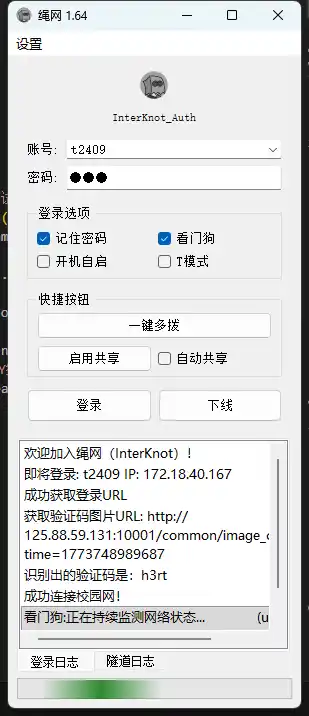
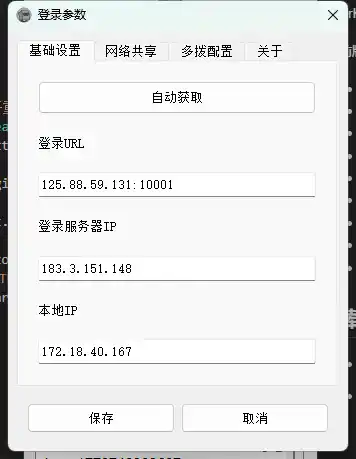
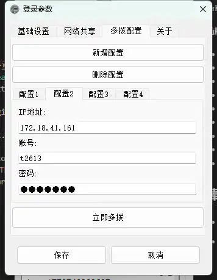
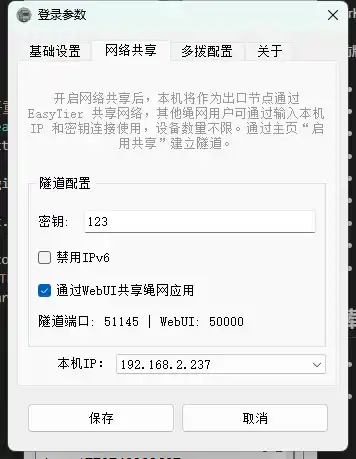
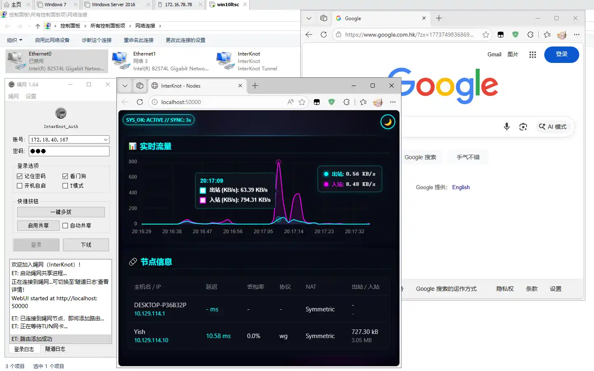
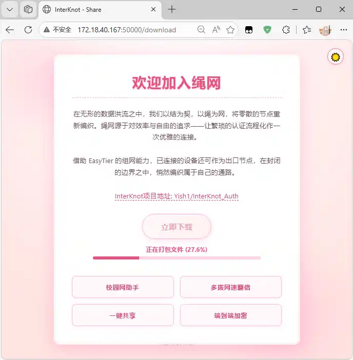

<div align="center">

# InterKnot_Auth (绳网认证)

[](https://github.com/Yish1/InterKnot/releases)
[](https://github.com/Yish1/InterKnot_Auth/releases)
[](https://github.com/Yish1/InterKnot_Auth)

</div>

[中文](README.md) | **English**

> [!WARNING]
> To keep this project safe, please avoid spreading it widely on large public platforms. Low-key usage is recommended.

## Introduction

InterKnot_Auth is a Windows desktop client for campus network ESurfing authentication.

Core features in the current version:

- **Student / Teacher accounts**: Ready to use out of the box.
- **Specify login IP**: Suitable for multi-dial or temporary remote connections. Note: specifying an IP in student mode will cause heartbeat failures (can be ignored).
- **One-click multi-dial**: Batch login based on configuration; when combined with multi-dial on a router, network speed can be multiplied.
- **Watchdog**: Monitors network adapter status in real time. When an IP is present but all detection endpoints are unreachable, it automatically reconnects.
- **Network sharing**: Powered by EasyTier — share your local network to other devices without limits.
- **Tunnel connection**: Powered by EasyTier — connect to a device that has network sharing enabled.
- **WebUI**: http://localhost:50000 — access from localhost to view the tunnel data dashboard; access from another device to open the InterKnot download page.
- **Password saving**: Encrypted and bound to the machine code; passwords are never uploaded to any server.
- **Auto-login**: Supports launch on startup and automatic login.

## Download

- Latest release:
  https://github.com/Yish1/InterKnot_Auth/releases/latest

- All releases:
  https://github.com/Yish1/InterKnot_Auth/releases

  [](https://github.com/Yish1/InterKnot_Auth/releases)

  [](https://github.com/Yish1/InterKnot_Auth/releases)

### Usage Instructions

1. Download the latest archive from the Releases page and install it. If your antivirus flags the file, trust and restore it (the executable contains privilege-escalation code to support auto-startup and tunnel functionality).
2. After extracting, run the main program as Administrator.
3. On first launch, enter your account credentials and enable **Remember Password / Auto-login / Watchdog** as needed.
4. After a successful login, the program can be minimized to the system tray.

## Building from Source

1. Prepare Python 3.10+ (a virtual environment is recommended).
2. Install dependencies:

```bash
pip install -r requirements.txt
```

3. Run:

```bash
python main.py
```

### Packaging (Nuitka)

The project is packaged with Nuitka on Windows. Example command:

```powershell
nuitka --standalone --lto=yes --clang --msvc=latest --windows-console-mode=disable --windows-uac-admin --enable-plugin=pyqt5,upx,anti-bloat --upx-binary="F:/Programs/upx/upx.exe(replace with your local upx path)" --include-data-dir=ddddocr=ddddocr --include-data-dir=jre=jre --include-data-dir=easytier=easytier --include-data-file=login.jar=login.jar --include-package=modules --nofollow-import-to=unittest --nofollow-import-to=debugpy --nofollow-import-to=pytest --nofollow-import-to=pydoc --nofollow-import-to=tkinter --nofollow-import-to=PyQt5.QtWebEngine --nofollow-import-to=PyQt5.QtNetwork --nofollow-import-to=PyQt5.QtQml --nofollow-import-to=PyQt5.QtQuick --noinclude-qt-translations --noinclude-setuptools-mode=nofollow --python-flag=no_docstrings,static_hashes --output-dir=SAC --output-filename=绳网认证.exe --windows-icon-from-ico=yish.ico --remove-output --assume-yes-for-downloads main.py
```

Post-packaging checklist:

- Confirm the output directory contains `ddddocr`, `jre`, `easytier`, and `login.jar`.
- If UPX causes PyQt5 plugin errors, manually replace the PyQt5 folder in the output with the one from the repository.
- Do a full login test (student / teacher / tunnel) on a clean Windows environment.

## Acknowledgements

- Login parameter handling references Pandaft's ESurfingPy-CLI:
  https://github.com/Pandaft/ESurfingPy-CLI
- Student-side login uses Rsplwe's ESurfingDialer:
  https://github.com/Rsplwe/ESurfingDialer

## Screenshots

### Main Window


### Login Parameter Configuration


### Multi-dial


### Tunnel Configuration


### Tunnel Connection


### WebUI

